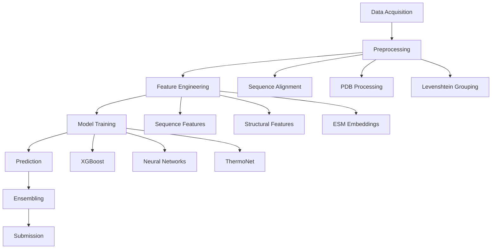

# Novozymes Enzyme Stability Prediction

## Table of Contents
- [About](#about)  
- [Summary of Results](#summary-of-results)  
- [Codeflow](#codeflow)  
- [Workspace & Environment](#workspace--environment)  
- [Dataset](#dataset)  
- [Reproducing the Pipeline](#reproducing-the-pipeline)  
- [Feature Representations](#feature-representations)  
- [Models](#models)  
- [Ensembling Strategy](#ensembling-strategy)  
- [Validation & Metrics](#validation--metrics)  
- [Error Analysis](#error-analysis)  
- [Limitations](#limitations)  
- [Future Work](#future-work)  
- [References](#references)  

---

## About

This project tackles the **Novozymes Enzyme Stability Prediction** Kaggle competition, which aims to predict the thermal stability of enzyme variants. Enhanced enzyme stability can significantly improve industrial processes by enabling enzymes to function under harsh conditions. The challenge involves predicting melting temperatures (Tm) from protein sequence data and structural information.

## Summary of Results

The final solution employs a multi-faceted approach combining:
- **XGBoost regression** with engineered sequence features
- **Structural features** including B-factor and SASA (Solvent Accessible Surface Area)
- **Ensemble methods** blending multiple prediction strategies
- **ESM-2 protein language model** for contact map analysis

Best submission achieved competitive performance on the private leaderboard through careful feature engineering and model ensembling.

## Codeflow

---

## Feature Representations

Feature engineering was central to the pipeline, combining **sequence-based**, **structural**, and **language-model-derived** features:

- **Sequence Features:**  
  Encoded amino acid properties such as hydrophobicity, charge, and polarity. Additionally, Levenshtein-grouped sequences ensured robust training by clustering mutations relative to wild-type sequences.

- **Structural Features:**  
  Derived from **PDB files** using **BioPandas** and **Bio.PDB**, including:
  - **B-factor (temperature factor):** Reflecting atomic mobility and structural flexibility.  
  - **SASA (Solvent Accessible Surface Area):** Computed with the **Shrake-Rupley algorithm** and normalized per residue.  
  - **Contact map** and **secondary structure** information were optionally extracted for correlation with ESM embeddings.

- **ESM Embeddings:**  
  The **ESM-2 protein language model** generated residue-level embeddings capturing evolutionary and contextual dependencies. These were averaged or reduced via PCA for compatibility with regression models.

---

## Models

Three main modeling approaches were used:

1. **XGBoost Regression:**  
   - Input: concatenated engineered features.  
   - Objective: `reg:squarederror`  
   - Tuned hyperparameters included `learning_rate`, `max_depth`, `subsample`, and `colsample_bytree`.  
   - Provided strong baseline performance and interpretability via feature importance plots.

2. **Neural Network (PyTorch / TensorFlow):**  
   - Architecture: Fully connected layers with dropout and batch normalization.  
   - Activation: ReLU; Output: linear regression head predicting `ΔTm`.  
   - Optimization: Adam with cosine learning rate decay and early stopping.  
   - Though implemented, this model was **less stable** and not optimal for the final ensemble.

3. **ThermoNet-Inspired CNN:**  
   - A lightweight adaptation of **ThermoNet**, modeling residue neighborhoods using physicochemical grids.  
   - Integrated SASA and B-factor channels to approximate 3D context.

---

## Ensembling Strategy

To boost generalization and leaderboard robustness:
- **Weighted blending** combined XGBoost, ThermoNet CNN, and ESM embedding regressors.  
- Blend weights were tuned via cross-validation using out-of-fold (OOF) predictions.  
- Final ensemble prediction:  
  \[
  \hat{y} = w_1 \cdot y_{XGB} + w_2 \cdot y_{ThermoNet} + w_3 \cdot y_{ESM}
  \]
- This strategy mitigated overfitting from single-model idiosyncrasies and captured complementary feature strengths.

---

## Validation & Metrics

- **Validation Split:**  
  Grouped by protein sequence clusters to prevent data leakage between homologous variants.  
  The hold-out set ensured distributional similarity to Kaggle’s test set.

- **Primary Metrics:**  
  - **Spearman’s rank correlation**: measured monotonic relationship between predicted and true stability values.  
  - **Mean Absolute Error (MAE):** secondary metric for interpretability.

- **Cross-Validation:**  
  5-fold grouped CV with stratification by sequence group, ensuring robustness and variance tracking across folds.

---

## Error Analysis

Analysis revealed:
- **Overestimation** of stability for highly mutated or structurally unstable variants.  
- **Underperformance** on rare motifs not well represented in the ESM embedding space.  
- Structural features (SASA, B-factor) were noisier for PDB files with incomplete residues.

Visualization of residuals confirmed that **sequence length** and **mutation density** were key error drivers.

---

## Limitations

- **Dataset sparsity:** few labeled variants per family.  
- **Noisy structure-derived features:** dependency on PDB prediction quality.  
- **Limited thermodynamic context:** stability influenced by factors not captured (e.g., solvent composition).

---

## Future Work

- Incorporate **AlphaFold2-multimer** predictions for structural context.  
- Fine-tune **ESM-2 embeddings** for thermal stability regression.  
- Explore **Graph Neural Networks (GNNs)** to directly model residue-residue interactions.  
- Integrate **Bayesian ensembling** for uncertainty quantification.

---

## References

- Novozymes Enzyme Stability Prediction, Kaggle Competition  
- Rao et al., "Transformer Protein Language Models" (ESM-2, Meta AI)  
- Li et al., "ThermoNet: Structure-based Thermostability Prediction"  
- XGBoost Documentation  
