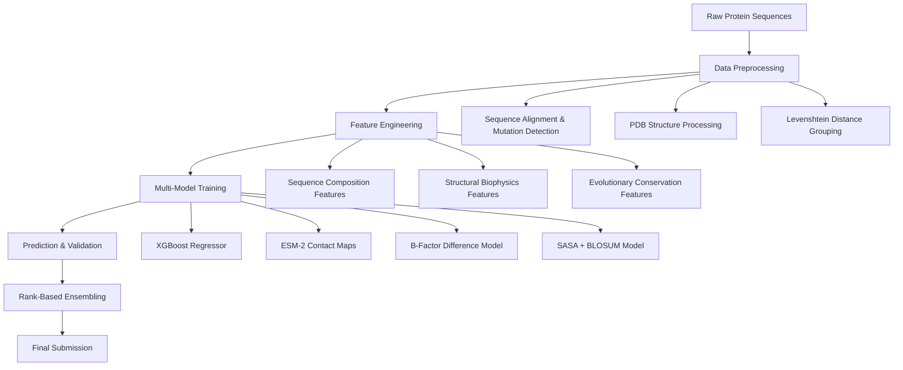

# Novozymes Enzyme Stability Prediction

- **Author:** [Chuanwan(Christine) Wu, Haoyuan Liu]
- **Submission Date:** [Jan, 2023]
- **Competition:** [Novozymes Enzyme Stability Prediction](https://www.kaggle.com/competitions/novozymes-enzyme-stability-prediction)
---


# Novozymes Enzyme Stability Prediction

## Table of Contents
- [About](#about)  
- [Summary of Results](#summary-of-results)  
- [Approach Overview](#approach-overview)  
- [Feature Engineering](#feature-engineering)  
- [Models](#models)  
- [Ensemble Strategy](#ensemble-strategy)  
- [Key Scientific Insights](#key-scientific-insights)  
- [Pipeline Architecture](#pipeline-architecture)  
- [Results & Validation](#results--validation)  
- [Future Work](#future-work)

## About

This repository contains a comprehensive 24th silver medal solution for the Novozymes Enzyme Stability Prediction competition, implementing multiple computational approaches to predict thermal stability (melting temperature Tm) of enzyme variants from protein sequences and structural data.

## Summary of Results

**Multi-Model Pipeline Combining:**
- **Primary Model**: XGBoost with engineered sequence + structural features
- **Structural Approaches**: B-factor differences and SASA analysis from PDB structures  
- **Deep Learning**: ESM-2 contact maps and evolutionary embeddings
- **Ensemble Methods**: Rank-based blending of diverse prediction strategies

---

## Approach Overview


---

## Feature Engineering

### Sequence-Based Features
- **Basic Statistics**: Sequence length, unique amino acid count, letter diversity
- **Amino Acid Composition**: Percentage distribution of all 20 amino acids
- **Physicochemical Groups**: 
  - Hydrophobic (A, V, I, L, M, F, Y, W)
  - Charged: Positive (R, H, K) and Negative (D, E)  
  - Polar (S, T, N, Q) and Special (C, G, P)
- **Mutation Analysis**: Position, type, and chemical nature relative to wildtype

### Structural Biophysics Features
- **B-factor Analysis**: Atomic flexibility parameters from PDB files
- **Solvent Accessibility**: SASA (Solvent Accessible Surface Area) using Shrake-Rupley algorithm
- **Contact Maps**: Residue interaction networks from ESM-2 predictions
- **Structural Alignment**: Wildtype vs mutant structural comparisons

### External & Evolutionary Features
- **BLOSUM62 Matrix**: Evolutionary substitution scores for mutations
- **Sequence Similarity**: Levenshtein distance for protein family grouping
- **Conservation Scores**: Position-specific evolutionary constraints
---

## Models

### 1. XGBoost Regressor (Primary)

```python
model = xgb.XGBRegressor(n_estimators=140, max_depth=4)
```

- Handled mixed feature types effectively  
- Provided robust baseline performance  
- Enabled feature importance analysis  

### 2. ESM-2 Contact Maps
- Protein language model for evolutionary information  
- Contact map analysis for stability prediction  
- Provided complementary signals

### 3. B-Factor Difference Model
- Direct use of B-factor differences
- Structural flexibility-based predictions
- Served as physics-based baseline method

### 4. SASA + BLOSUM Hybrid Model
- Combined solvent accessibility with evolutionary conservation
- SASA-based predictions weighted by substitution scores
- Integrated structural and evolutionary information

---

## Ensemble Strategy

Final submission used **rank-based ensembling**:

```python
final_rank = (0.78 * rankdata(xgboost_predictions) +
              0.15 * rankdata(b_factor_predictions) + 
              0.07 * rankdata(esm_predictions)) / total_samples
```

This approach leveraged **relative ordering** rather than absolute values from different methods, improving leaderboard robustness.

---

## Validation & Results

### Validation Strategy
- **Train-Test Split:** 80-20 random split  
- **Metrics:** Spearman correlation, MAE  
- **Cross-Validation:** Basic k-fold validation  

### Key Findings
- XGBoost with comprehensive features provided strongest individual performance  
- Structural features (B-factor, SASA) offered valuable complementary information  
- Simple ensembling improved robustness over single models  
- Sequence-based features were more reliable than structure-only approaches  

---

## Future Work

### Immediate Improvements
- **Better Feature Engineering:** Dihedral angles, secondary structure  
- **Advanced Ensembling:** Neural network meta-learners  
- **Hyperparameter Optimization:** Systematic tuning of all models  

---

## Conclusion

This project demonstrates a practical, feature-engineered approach to protein stability prediction that balances computational efficiency with competitive performance. The combination of sequence-based machine learning with structural bioinformatics insights provides a robust framework for enzyme engineering applications.

*All code is available in the accompanying Jupyter notebook.*
