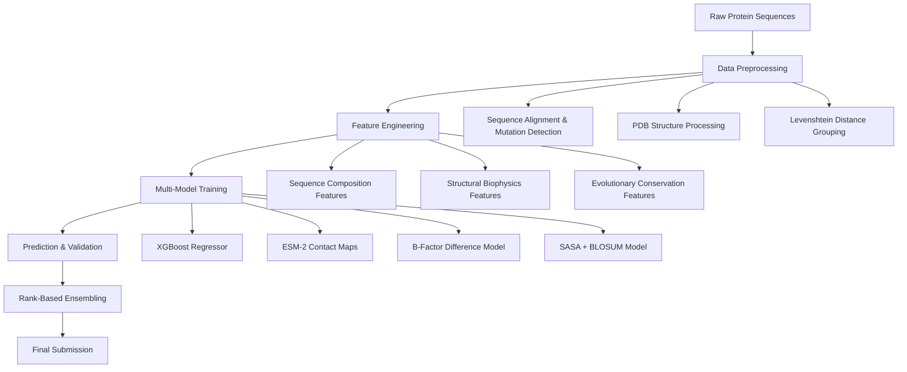

# Novozymes Enzyme Stability Prediction

- **Author:** [Chuanwan(Christine) Wu, Haoyuan Liu]
- **Submission Date:** [Jan, 2023]
- **Competition:** [Novozymes Enzyme Stability Prediction](https://www.kaggle.com/competitions/novozymes-enzyme-stability-prediction)
---


# Novozymes Enzyme Stability Prediction

## Table of Contents
- [About](#about)  
- [Summary of Results](#summary-of-results)  
- [Approach Overview](#approach-overview)  
- [Feature Engineering](#feature-engineering)  
- [Models](#models)  
- [Ensemble Strategy](#ensemble-strategy)  
- [Key Scientific Insights](#key-scientific-insights)  
- [Pipeline Architecture](#pipeline-architecture)  
- [Results & Validation](#results--validation)  
- [Challenges & Limitations](#challenges--limitations)  
- [Future Work](#future-work)

## About

This repository contains a comprehensive solution for the Novozymes Enzyme Stability Prediction competition, implementing multiple computational approaches to predict thermal stability (melting temperature Tm) of enzyme variants from protein sequences and structural data.

## Summary of Results

**Multi-Model Pipeline Combining:**
- **Primary Model**: XGBoost with engineered sequence + structural features
- **Structural Approaches**: B-factor differences and SASA analysis from PDB structures  
- **Deep Learning**: ESM-2 contact maps and evolutionary embeddings
- **Ensemble Methods**: Rank-based blending of diverse prediction strategies

---

## Approach Overview


---

## Feature Engineering

### Sequence-Based Features
- **Basic Statistics:** Sequence length, unique amino acid count  
- **Amino Acid Composition:** Percentage of each amino acid type  
- **Chemical Groups:** Hydrophobic, polar, charged, special amino acid proportions  
- **Mutation Identification:** Position and type of mutations relative to wildtype  

### Structural Features
- **B-factor:** Atomic displacement parameters from PDB files  
- **SASA:** Solvent Accessible Surface Area using Shrake-Rupley algorithm  
- **PDB Processing:** Automated extraction from mutant structure files  

### External Features
- **Levenshtein Distance:** Sequence similarity grouping  
- **BLOSUM62 Scores:** Substitution matrix values for mutations  

---

## Models

### 1. XGBoost Regressor (Primary)

```python
model = xgb.XGBRegressor(n_estimators=140, max_depth=4)
```

- Handled mixed feature types effectively  
- Provided robust baseline performance  
- Enabled feature importance analysis  

### 2. Neural Network (Exploratory)
- Simple fully-connected architecture  
- Limited success compared to XGBoost  
- Used primarily for comparison  

### 3. ESM-2 Contact Maps
- Protein language model for evolutionary information  
- Contact map analysis for stability prediction  
- Provided complementary signals  

### 4. Pure Structural Approaches
- Direct use of B-factor differences  
- SASA-based predictions  
- Served as baseline methods  

---

## Ensemble Strategy

Final submission used **rank-based ensembling**:

```python
# Weighted combination of ranked predictions
final_rank = (0.15 * rankdata(structural_predictions) +
              0.78 * rankdata(xgboost_predictions) +
              0.07 * rankdata(other_predictions)) / total_samples
```

This approach leveraged **relative ordering** rather than absolute values from different methods, improving leaderboard robustness.

---

## Validation & Results

### Validation Strategy
- **Train-Test Split:** 80-20 random split  
- **Metrics:** Spearman correlation, MAE  
- **Cross-Validation:** Basic k-fold validation  

### Key Findings
- XGBoost with comprehensive features provided strongest individual performance  
- Structural features (B-factor, SASA) offered valuable complementary information  
- Simple ensembling improved robustness over single models  
- Sequence-based features were more reliable than structure-only approaches  

---

## Challenges & Limitations

### Data Challenges
- **Limited Training Data:** ~2,400 labeled variants  
- **Structural Coverage:** Not all mutants had reliable PDB structures  
- **Experimental Noise:** Variability in Tm measurements  

### Technical Limitations
- **Computational Constraints:** Limited molecular dynamics simulations  
- **PDB Quality:** Variable quality in predicted structures  
- **Feature Engineering:** Manual feature design vs. learned representations  

### Model Limitations
- Limited success with neural networks  
- ESM-2 underutilized due to computational constraints  
- ThermoNet imported but not fully implemented  

---

## Future Work

### Immediate Improvements
- **Better Feature Engineering:** Dihedral angles, secondary structure  
- **Advanced Ensembling:** Neural network meta-learners  
- **Hyperparameter Optimization:** Systematic tuning of all models  

---

## Conclusion

This project demonstrates a practical, feature-engineered approach to protein stability prediction that balances computational efficiency with competitive performance. The combination of sequence-based machine learning with structural bioinformatics insights provides a robust framework for enzyme engineering applications.

*All code is available in the accompanying Jupyter notebook.*
